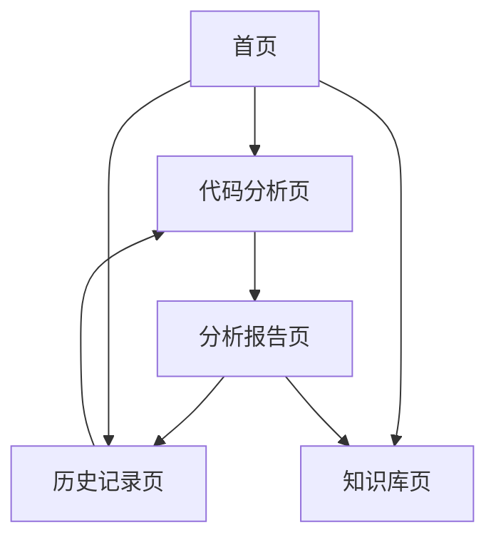

# 智能代码审查与优化助手 - 产品需求文档

## 1. 产品概述

智能代码审查与优化助手是一个基于 AI 技术的 Web 应用，旨在帮助开发者自动分析代码质量、发现潜在问题并提供优化建议。

该产品解决了开发者在代码审查过程中耗时费力、容易遗漏问题的痛点，通过 AI 智能分析提供即时、准确的代码质量评估和改进建议。

目标是成为开发者日常编程工作中不可或缺的代码质量保障工具，提升代码质量和开发效率。

## 2. 核心功能

### 2.1 用户角色

| 角色 | 注册方式 | 核心权限 |
|------|----------|----------|
| 普通用户 | 邮箱注册 | 可上传代码文件进行基础分析，查看质量评分和基本建议 |
| 高级用户 | 付费升级 | 可批量分析项目，获得详细优化报告，使用高级分析功能 |

### 2.2 功能模块

我们的智能代码审查助手包含以下主要页面：

1. **首页**：产品介绍、功能展示、快速上传入口
2. **代码分析页**：代码上传、实时分析、结果展示
3. **分析报告页**：详细分析结果、优化建议、代码质量评分
4. **历史记录页**：分析历史、项目管理、进度跟踪
5. **知识库页**：编程最佳实践、常见问题解答、学习资源

### 2.3 页面详情

| 页面名称 | 模块名称 | 功能描述 |
|----------|----------|----------|
| 首页 | 产品介绍区 | 展示产品核心价值、功能亮点、用户评价 |
| 首页 | 快速体验区 | 提供代码片段上传入口，支持拖拽上传 |
| 首页 | 导航菜单 | 页面导航、用户登录入口、帮助文档链接 |
| 代码分析页 | 代码上传模块 | 支持多种编程语言文件上传，实时语法检查 |
| 代码分析页 | 分析配置模块 | 选择分析类型、设置检查规则、自定义分析参数 |
| 代码分析页 | 实时分析模块 | 显示分析进度、实时反馈、错误提示 |
| 分析报告页 | 质量评分模块 | 显示代码质量总分、各维度评分、趋势图表 |
| 分析报告页 | 问题列表模块 | 按严重程度分类显示问题、提供修复建议 |
| 分析报告页 | 优化建议模块 | AI 生成的代码优化建议、最佳实践推荐 |
| 分析报告页 | 代码对比模块 | 原代码与优化后代码的对比展示 |
| 历史记录页 | 项目列表模块 | 显示所有分析过的项目、支持搜索和筛选 |
| 历史记录页 | 统计图表模块 | 代码质量趋势、改进进度、统计数据 |
| 知识库页 | 最佳实践模块 | 编程规范、代码风格指南、性能优化技巧 |
| 知识库页 | 学习资源模块 | 教程文档、视频教程、案例分析 |

## 3. 核心流程

**普通用户流程：**
用户访问首页 → 上传代码文件 → 选择分析配置 → 等待 AI 分析 → 查看分析报告 → 下载优化建议 → 查看历史记录

**高级用户流程：**
用户登录 → 创建项目 → 批量上传代码 → 配置高级分析规则 → 获得详细报告 → 导出分析数据 → 跟踪改进进度

## 4. 用户界面设计

### 4.1 设计风格

- **主色调**：科技蓝 (#2563EB) 和深灰 (#1F2937)
- **辅助色**：成功绿 (#10B981)、警告橙 (#F59E0B)、错误红 (#EF4444)
- **按钮风格**：圆角矩形，渐变效果，悬停动画
- **字体**：主标题使用 Inter Bold 18px，正文使用 Inter Regular 14px
- **布局风格**：卡片式设计，左侧导航，响应式布局
- **图标风格**：线性图标，统一的视觉语言，支持深色模式

### 4.2 页面设计概览

| 页面名称 | 模块名称 | UI 元素 |
|----------|----------|----------|
| 首页 | 产品介绍区 | 大标题、特性卡片、渐变背景、动画效果 |
| 首页 | 快速体验区 | 拖拽上传区域、进度条、文件类型图标 |
| 代码分析页 | 代码上传模块 | 代码编辑器、语法高亮、行号显示 |
| 代码分析页 | 分析配置模块 | 下拉选择器、开关按钮、滑块控件 |
| 分析报告页 | 质量评分模块 | 环形进度图、评分卡片、颜色编码 |
| 分析报告页 | 问题列表模块 | 表格布局、严重程度标签、展开详情 |
| 历史记录页 | 项目列表模块 | 网格布局、搜索框、筛选标签 |
| 知识库页 | 最佳实践模块 | 文章卡片、分类标签、阅读进度 |

### 4.3 响应式设计

产品采用桌面优先的设计策略，同时兼容移动端访问。在移动设备上优化触摸交互，调整布局为单列显示，确保核心功能在小屏幕上的可用性。